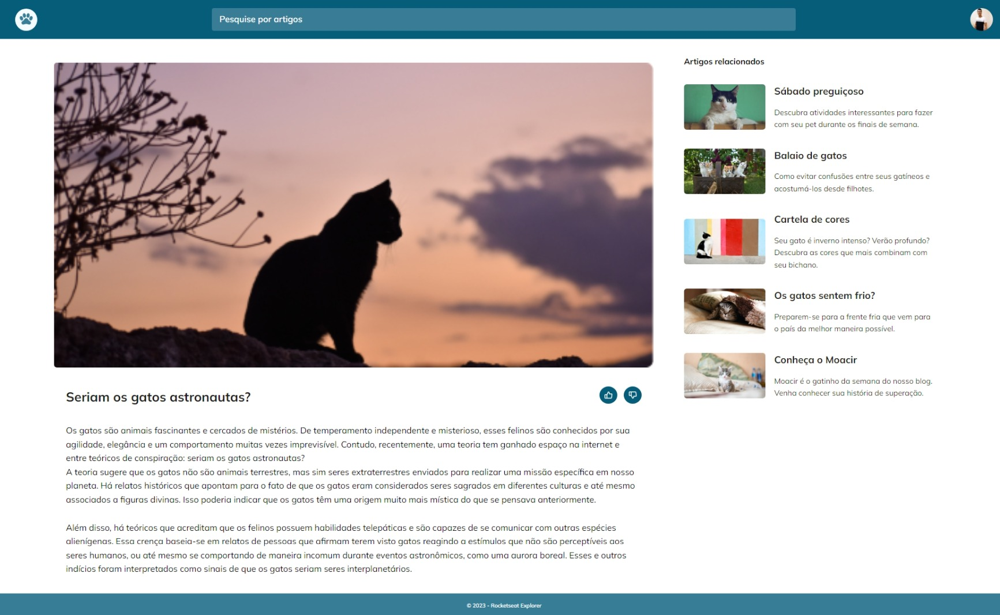

# Blog-de-Gatos

Esse desafio consiste em desenvolver um site responsivo de blog com artigos sobre gatos. O projeto também apresenta uma barra de busca, recomendação de artigos relacionados e avaliação do artigo.

## Deploy

Para fazer o deploy desse projeto rode  

## Demonstração

  